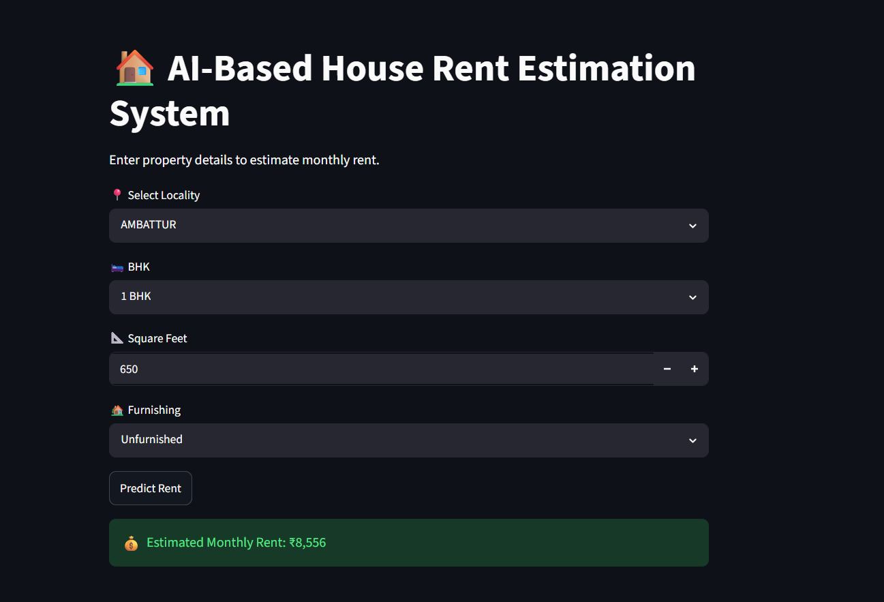

# AI-Based House Rent Estimation System

## Overview

This project predicts house rental prices using Machine Learning based on property features such as locality, BHK, square footage, and condition.

## Technologies Used

* Python
* Pandas
* NumPy
* Scikit-learn
* Google Colab

## Machine Learning Model

* Random Forest Regressor

## Dataset

* 1031 rental property records
* 43 unique localities

## Features Used

* Locality
* BHK
* Square Feet
* Condition

## Results

* R² Score: 0.79

## Author

Asbanesh Joel D

## Dataset

A custom House Rent Prediction dataset published on Kaggle.

🔗 Dataset Link: [Kaggle Dataset](https://www.kaggle.com/datasets/asbaneshjoel/house-rent-prediction-dataset)

Features: Locality, BHK, SQ. FT, Condition, and Rent.

## Application Preview

